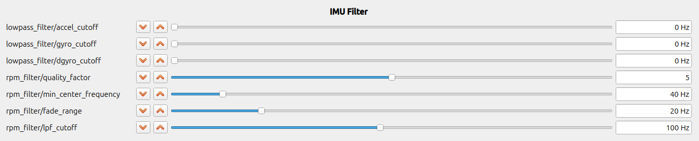

# RPM Filter

## What Is an RPM Filter?

---

An RPM filter is a notch filter whose center frequency tracks the motor rotation frequency and its harmonics.
On drones, especially multicopters, most vibration in the IMU comes from the propellers,
so vibration can be effectively removed by making the notch filter center frequency follow the motor RPM.

## Effect of the RPM Filter

---

The greatest advantage of using an RPM filter is its extremely high filtering effectiveness.
The gain at the center frequency of a notch filter is zero, so ideally,
vibration at the center frequency disappears completely.
In practice, vibration does not disappear completely due to center-frequency errors and discretization errors,
but it still provides a much stronger filtering effect than a low-pass filter.

The images below show IMU time-series data and frequency analysis results when flying an F450.
Gray is the raw data, and blue is the filtered data.
The left column shows the result when only an LPF with a 40 Hz cutoff is applied,
while the right column shows the result when only the RPM filter is applied.
With only the LPF, high frequencies can be reduced but vibration at the motor rotation speed remains strong.
With the RPM filter, however, vibration at the motor rotation frequency and its second and third harmonics is also greatly reduced.

When IMU vibration, especially gyro vibration, is reduced, fluctuations in motor RPM are also reduced.
In the images below, blue shows the observed RPM and red shows the target RPM.
The RPM fluctuation is smaller when the notch filter is used.
As a result, attitude control becomes more stable because unnecessary forces are not applied,
and it also reduces motor heat generation and makes the propeller sound smoother.

## Supported FMUs

---

The RPM filter can be used with the following FMUs.

- FC2xx

## Parameters

---

You can configure the filter in the `IMU Filter` section of `Param Tuning` in the GCS.
The description, initial value, and tuning method for each parameter are described below.

### `lowpass_filter/*_cutoff`

This is the cutoff frequency of a low-pass filter separate from the RPM filter.
Initially, set all three to 0 Hz. This disables the filters.
Because the RPM filter cannot remove vibrations other than those caused by the motors and propellers,
partially enable the LPF if strong vibration still remains.

### `rpm_filter/quality_factor`

This value determines the sharpness of the notch filter.
A larger value makes the filter sharper (narrower bandwidth), but with less delay.
The default is 0, which disables the filter.
First, set it to 5, which provides a good balance between delay and bandwidth.
After flying and confirming with an FFT that the vibration has been reduced enough that no peak is visible,
increase the value one step at a time until just before a peak remains.

### `rpm_filter/min_center_frequency`, `rpm_filter/fade_range`

These parameters define the center-frequency range to which the RPM filter is applied.
If the former is $f_\mathrm{m}$ and the latter is $f_\mathrm{f}$,
the notch filter is applied as follows for the center frequency $f_\mathrm{c}$.

- $f_\mathrm{c} \lt f_\mathrm{m}$: Filter disabled
- $f_\mathrm{m} \le f_\mathrm{c} \lt f_\mathrm{m} + f_\mathrm{f}$:
  Transition region (the filter becomes stronger as $f_\mathrm{c}$ increases)
- $f_\mathrm{m} + f_\mathrm{f} \le f_\mathrm{c}$: Filter enabled

A region where the filter is disabled is provided
because filtering low frequencies near the control bandwidth may negatively affect responsiveness and stability.
The transition region is provided to avoid sudden changes in the overall filter characteristics
when the RPM filter switches between enabled and disabled.
For the hover rotation frequency $f_\mathrm{h}$,
initially set approximately $f_\mathrm{m}=\frac{f_\mathrm{h}}{2}$ and $f_\mathrm{f}=\frac{f_\mathrm{h}}{4}$.

### `rpm_filter/lpf_cutoff`

This is the cutoff frequency of the low-pass filter applied to the center frequency of the RPM filter.
The motor RPM obtained from the ESC fluctuates significantly,
and using it directly as the center frequency would cause the filter characteristics to vary too much, so it is smoothed.
In most cases, the default setting is fine.
