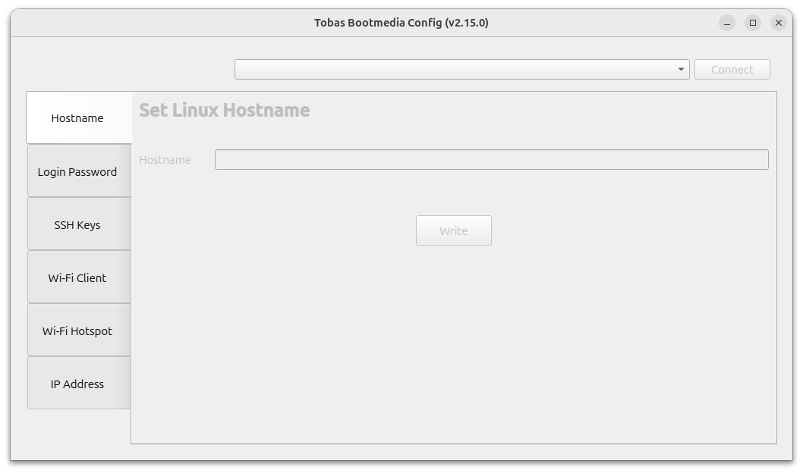
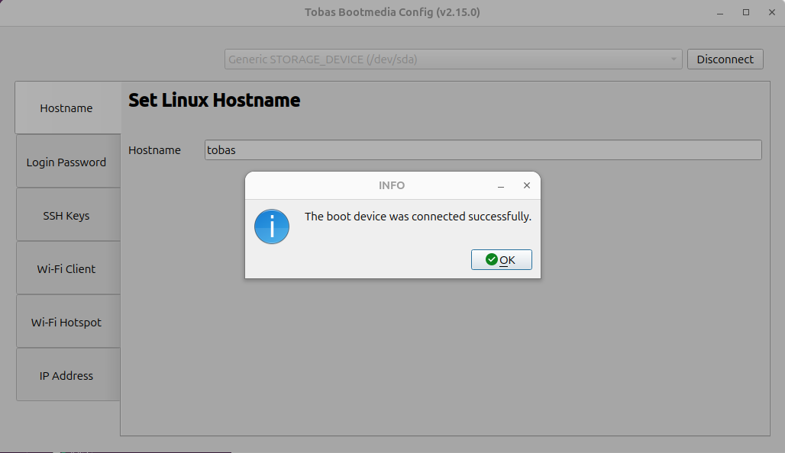
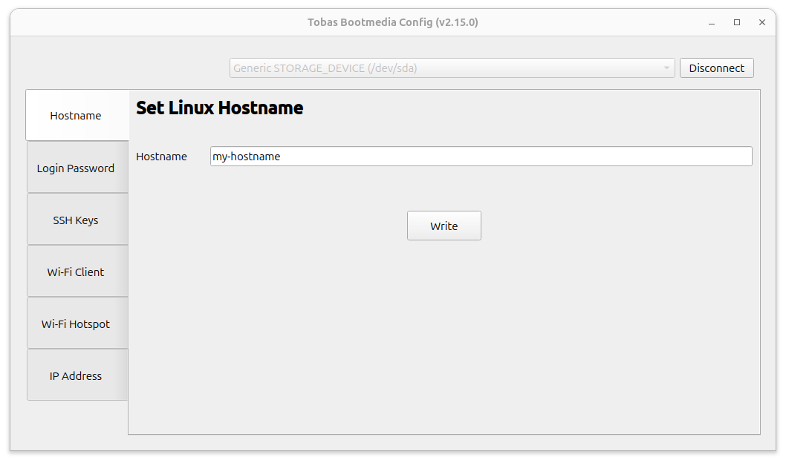
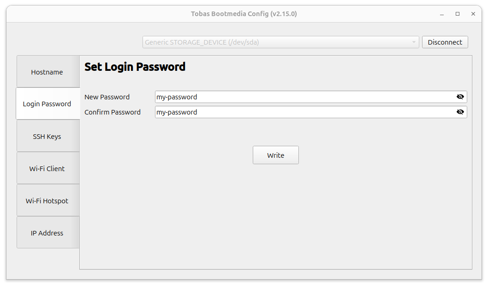
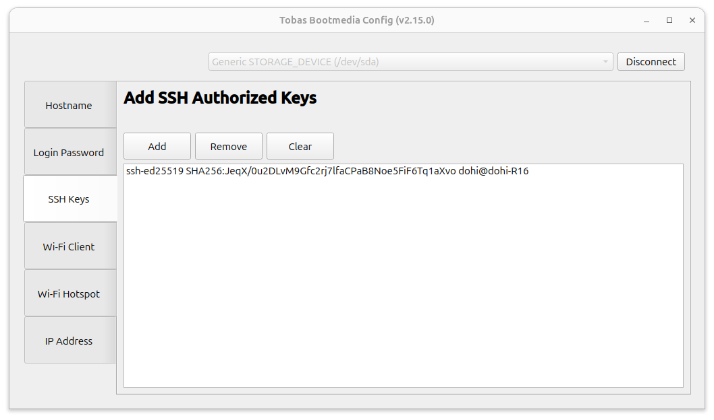
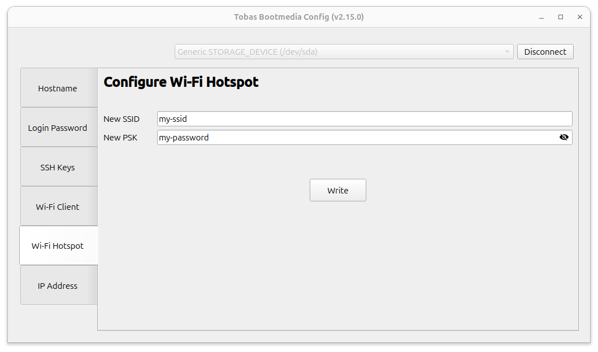
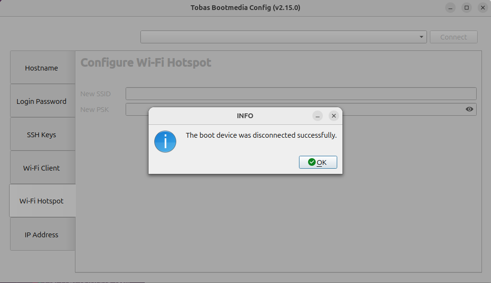

# Configuring the Boot Device

First, directly edit the boot device to configure the initial communication settings.
Prepare a microSD card with the Tobas image written to it.

## Preparation

---

### Launching the Configuration GUI

Open `TobasBootmediaConfig` from the application menu, or run the following in a terminal.
Because external volumes are handled here, you will be asked for your user login password.

```bash
$ tobas_bootmedia_config
```



### Connecting to the Boot Device

Insert the SD card into your PC using a suitable USB card reader.
If the Tobas image has been written correctly, the SD card will become selectable from the selection list at the top of the GUI.

Make sure the correct SD card is selected, then click `Connect`.
The SD card will be mounted on the PC, and the current settings will be loaded.



## Settings

---

### Hostname

Edit the Linux hostname.

By default, Tobas uses the hostname to identify devices on the network, so hostnames within the expected subnet must be unique.
Identification by fixed IP address is also possible, but if you use multiple units at the same time, we recommend ensuring that their hostnames do not overlap.

Edit the hostname and click `Write` to write the new hostname to the SD card.



### Login Password

Edit the login password.

The default `tobas` works without issue, but changing it is recommended from a security standpoint.

Enter the login password in `New Password`, and enter the same value in `Confirm Password` for confirmation.
If the two entries match and the password is valid, the `Write` button will be enabled.
Click `Write` to write the entered password to the SD card.



### SSH Keys

Configure SSH key authentication.

Tobas uses SSH key authentication for some operations from the ground station to the flight controller (FC), so you must register the public key of the PC used as the ground station on the FC.

First, create an SSH key.
Launch `Passwords and Keys` from the application menu, then select `Secure Shell key` from the `+` button in the upper left.
In the dialog that appears, enter a suitable identifier (such as `<ユーザ名>@<ホスト名>`) in `Description`, then click `Generate`.
In the next dialog, click `OK` to generate the SSH public and private keys. You can leave the password blank.
Then click `OpenSSH keys` and confirm that the created key is displayed.
Double-click the key, note down `Public key` in the dialog that appears, then close `Password and Keys`.


Return to `Tobas Bootmedia Config`, click `Add`, and copy and paste the public key you noted earlier into the dialog that appears.
Click `OK` to add the public key to the list and write it to the SD card at the same time.



### Wi-Fi Client

Configure the FC to operate as a Wi-Fi client.

Tobas uses ROS 2 (DDS) for remote communication, so the FC, ground station, and all other devices that need to communicate must belong to the same subnet.
If you only use Ethernet, or if you operate the FC as an access point, you can skip this section.

Click `Add`, and enter the SSID and PSK of the access point you want to connect to in the dialog that appears.
`Priority` is the connection priority; when multiple networks are available, the network with the higher value is preferred.
Click `OK` to add the access point to the table and write it to the SD card at the same time.


### Wi-Fi Hotspot

Configure the FC to operate as a Wi-Fi access point.

As mentioned above, the FC and ground station must belong to the same subnet to communicate.
Making the FC itself an access point is convenient for outdoor test flights because you do not need to prepare an external router.
If you operate the FC only as a Wi-Fi client, you can skip this section.

Enter any SSID and PSK in `New SSID` and `New PSK`, respectively.
If both are valid, the `Write` button will be enabled.
Click `Write` to write the entered SSID and PSK to the SD card.



## Finish

---

Once you have completed the settings up to this point, click `Disconnect`.
The boot device will be unmounted and ready to remove.
Close the GUI and remove the SD card from the PC.



## Next Steps

---

This completes the procedure.
Next, create your first project using Tobas Setup Assistant.
