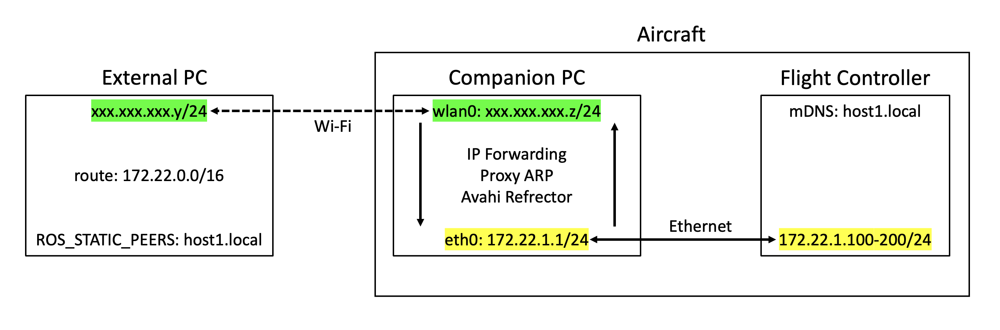

# コンパニオン PC を介した通信

このページでは，NVIDIA Jetson Nano などの Linux コンパニオン PC を介して，
外部 PC と FC を従来と同様に SSH と ROS 2 で通信させる方法を説明します．

この方法により，元々の PC-FC 間の通信を損なうことなく，機体側に画像処理や SLAM などの高度な処理に必要な計算力を追加することができます．

## ネットワーク構成

---

この構成では，コンパニオン PC を Wi-Fi クライアントとして使用すると同時にルータとしても使用します．
IP forwarding と Proxy ARP によって外部 PC から FC 側サブネットへパケットを転送し，Avahi で mDNS を中継します．

以下では，FC 側サブネットを`172.22.1.0/24`とします．
コンパニオン PC は`172.22.1.1`を使用し，FC には`172.22.1.100`から`172.22.1.200`までのアドレスを DHCP で割り当てます．



| 機能                                           | サービス        |
| ---------------------------------------------- | --------------- |
| FC への IP アドレス割り当て                    | Dnsmasq         |
| 外部 PC から FC へのパケット転送               | IP Forwarding   |
| FC が外部 LAN に直接接続されているように見せる | Proxy ARP       |
| `.local`ホスト名の中継                         | Avahi Reflector |

!!! warning

    外部 PC が接続する LAN や VPN で`172.22.0.0/16`が既に使われている場合，
    この手順で追加するルートと競合します．
    その場合は，他のネットワークと重複しないプライベートアドレス帯に以下の設定を読み替えてください．

## 前提条件

---

ここでは以下の条件を前提とします．

- 外部 PC とコンパニオン PC が直接通信可能な同じ LAN に属していること
- コンパニオン PC が NetworkManager でネットワークを管理していること
- コンパニオン PC と FC がイーサネットで接続されていること
- 外部 PC に ROS 2 Jazzy と Cyclone DDS がインストールされていること

## 使用するインターフェースを確認する

---

コンパニオン PC のイーサネットのインターフェース名と NetworkManager の接続プロファイル名を確認します．

Jetson を使用している場合は，先に USB Device Mode が作成する仮想イーサネットを無効化します．
Jetson 以外のコンパニオン PC ではこのコマンドを実行しないでください．

```bash
$ sudo systemctl disable --now nv-l4t-usb-device-mode-runtime.service
```

続けて，インターフェースとアドレスを確認します．

```bash
$ nmcli -f DEVICE,TYPE,STATE,CONNECTION device
```

得られた出力から，`TYPE`が`ethernet`の行を探してください．

```txt
DEVICE             TYPE      STATE                   CONNECTION
...
eth0               ethernet  connected               Wired connection 1
...
```

この行における`DEVICE`の値がインターフェース名，`CONNECTION`の値が接続プロファイル名です．

以下では次の値を使います．
実際の環境に合わせて読み替えてください．

| 項目                                                           | このページでの値     |
| -------------------------------------------------------------- | -------------------- |
| コンパニオン PC の Wi-Fi インターフェース名                    | `wlan0`              |
| コンパニオン PC のイーサネットインターフェース名               | `eth0`               |
| コンパニオン PC の NetworkManager イーサネット接続プロファイル | `Wired connection 1` |
| FC の mDNS ホスト名                                            | `host1.local`        |

## コンパニオン PC を設定する

---

### 必要パッケージのインストール

Dnsmasq と Avahi をインストールします．

```bash
$ sudo apt update
$ sudo apt install -y dnsmasq avahi-daemon
```

### イーサネットの IP アドレスを固定する

イーサネットの接続プロファイルに`172.22.1.1/24`を設定します．
`Wired connection 1`は実際の接続プロファイル名に置き換えてください．
この接続をデフォルトルートにしないため，ゲートウェイは設定せず，`ipv4.never-default`を有効化します．

```bash
$ sudo nmcli connection modify "Wired connection 1" \
    ipv4.method manual \
    ipv4.addresses 172.22.1.1/24 \
    ipv4.gateway "" \
    ipv4.never-default yes
```

### DHCP サーバを設定する

FC に IP アドレスを割り当てるため，`/etc/dnsmasq.d/tobas-fc.conf`を作成します．
`eth0`は実際のイーサネットインターフェース名に置き換えてください．

```ini
interface=eth0
bind-dynamic
dhcp-range=172.22.1.100,172.22.1.200,255.255.255.0,12h
```

### IP forwarding と Proxy ARP を有効化する

後述のルートを設定すると，外部 PC は FC 宛てのパケットを同じ LAN 上の端末に送るように処理します．
Proxy ARP を有効にすると，コンパニオン PC が FC の代わりに外部 PC へ応答し，
FC 宛てのパケットを受け取ります．
これにより，外部 PC からは FC が同じ LAN に直接接続されているように見えます．

IP forwarding は，コンパニオン PC が受け取ったパケットを，
外部 LAN 側インターフェースと FC 側イーサネットの間で転送します．
これらを有効にするため，`/etc/sysctl.d/99-tobas-routing.conf`を作成します．
`wlan0`は実際の外部 LAN 側インターフェース名に置き換えてください．

```ini
net.ipv4.ip_forward=1
net.ipv4.conf.wlan0.proxy_arp=1
```

### mDNS リフレクタを有効化する

FC が広告する`.local`ホスト名を外部 LAN へ中継するため，`/etc/avahi/avahi-daemon.conf`の`[reflector]`セクションでリフレクタを有効化します．
既に`[reflector]`セクションがある場合は新しく追加せず，既存の値を編集してください．

```ini
[reflector]
enable-reflector=yes
```

## 外部 PC に FC 側サブネットへのルートを設定する

---

外部 PC が現在のデフォルトルートで使用している Wi-Fi またはイーサネットの NIC に FC 側サブネットへのルートを自動的に設定するため，
`/etc/NetworkManager/dispatcher.d/90-tobas-route`を作成します．

```sh
#!/bin/sh

# インターフェースが有効化されたとき，またはDHCP情報が更新されたときだけ処理する．
ACTION="$2"
[ "$ACTION" = "up" ] || [ "$ACTION" = "dhcp4-change" ] || exit 0

# 現在のデフォルトルートで使用されているNICを取得する．
IFACE="$(ip route get 1.1.1.1 | awk '{for(i=1;i<=NF;i++) if($i=="dev"){print $(i+1); exit}}')"

# デフォルトルートが存在しなければ何もしない．
[ -n "$IFACE" ] || exit 0

# NICの種類を取得する．
TYPE="$(nmcli -g GENERAL.TYPE device show "$IFACE" 2>/dev/null)"

# Wi-FiまたはEthernet以外なら何もしない．
[ "$TYPE" = "wifi" ] || [ "$TYPE" = "ethernet" ] || exit 0

# FC側サブネットへのルートを，現在のデフォルトルートのNICに設定する．
ip route replace 172.22.0.0/16 dev "$IFACE"
```

スクリプトを root が所有する実行可能ファイルにします．

```bash
$ sudo chmod 755 /etc/NetworkManager/dispatcher.d/90-tobas-route
$ sudo chown root:root /etc/NetworkManager/dispatcher.d/90-tobas-route
```

## 外部 PC から FC への通信を確認する

---

上記の操作が完了したら，一度 FC，コンパニオン PC，外部 PC を再起動してください．
設定が正しく反映されていれば，コンパニオン PC を介して外部 PC と FC の間で通信ができるようになっているはずです．

### SSH 接続を確認する

特別な SSH トンネルやポート転送は必要ありません．
通常の SSH 接続と同じように FC の mDNS ホスト名を指定できます．

```bash
$ ssh pi@host1.local
```

### ROS 2 通信を確認する

ルータを越えたネットワークでは，デフォルトのマルチキャストによる ROS 2 discovery は外部 PC と FC の間を通過しません．
そのため，外部 PC で`ROS_STATIC_PEERS`に FC のホスト名を指定し，Cyclone DDS がユニキャストで FC を検出できるようにします．

```bash
$ source /opt/ros/jazzy/setup.bash
$ export RMW_IMPLEMENTATION=rmw_cyclonedds_cpp
$ export ROS_STATIC_PEERS=host1.local
$ ros2 daemon stop
$ ros2 topic list
```

FC のトピックが表示されれば discovery は正常です．
実際にメッセージを受信できることも確認してください．

```bash
$ ros2 topic echo <Topic Name>
```

## 発展

---

### FC の IP を固定する

上記では FC の識別に mDNS ホスト名を使用しましたが，代わりに固定 IP アドレスを使用することもできます．

FC を起動する前に，[Tobas Bootmedia Config](../getting_started/bootmedia_config.md)を使ってブートデバイスに固定 IP アドレスを書き込みます．
`IP Address`タブの`Wired`に以下を設定してください．

| 項目            | 設定値               |
| --------------- | -------------------- |
| `Method`        | `Manual`             |
| `Prefix Length` | `24 - 255.255.255.0` |
| `Address`       | `172.22.1.2`         |
| `Gateway`       | `172.22.1.1`         |

`Write`をクリックして設定を書き込んだ後，`Disconnect`をクリックしてブートデバイスを取り外し，FC を起動します．
`Gateway`にコンパニオン PC のアドレス`172.22.1.1`を指定することで，FC から外部 PC へ応答パケットを返せるようになります．

この場合，コンパニオン PC の DHCP サーバ設定は不要です．
SSH と`ROS_STATIC_PEERS`に`172.22.1.2`を直接指定する場合は，mDNS リフレクタも不要です．

```bash
$ ssh pi@172.22.1.2
$ export ROS_STATIC_PEERS="172.22.1.2"
```

### 複数機を同一 LAN 内で運用する

各コンパニオン PC の FC 側サブネットと，各 FC のホスト名を一意にすれば，1 つの外部 PC から複数の機体と通信することができます．
例えば，3 機の場合は以下のように設定すればよいです．

| 機体 | FC 側サブネット | コンパニオン PC | DHCP 範囲                     | FC のホスト名 |
| ---- | --------------- | --------------- | ----------------------------- | ------------- |
| A    | `172.22.1.0/24` | `172.22.1.1`    | `172.22.1.100`–`172.22.1.200` | `host1.local` |
| B    | `172.22.2.0/24` | `172.22.2.1`    | `172.22.2.100`–`172.22.2.200` | `host2.local` |
| C    | `172.22.3.0/24` | `172.22.3.1`    | `172.22.3.100`–`172.22.3.200` | `host3.local` |

複数の FC と ROS 2 通信する場合は，セミコロンで区切って静的ピアを指定します．

```bash
$ export ROS_STATIC_PEERS="host1.local;host2.local;host3.local"
```
